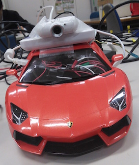

Self-driving-RC-car
===================

  This is what i made in my schools project.
  hack any radio-controlled medel car and put Raspberry Pi, camera,battery on it.
and it will be self-driving-car!!

## Description

  Since Raspberry Pi is slow for image processing, you need another computer(let's call it Main PC).
  These codes in this repositly is for the Main PC for image processing.
  Codes runs in Raspberry Pi is [here](https://github.com/TenninYan/Self-driving-RC-car-raspi.git)

  You need Python and opencv in Main PC. For Raspberry Pi you need Python. Also you need a way to transfer images from camera on car. I used mjpg-streamer. If you put smartphone, I think you have another way.

## Usage

# Detection of stop sign

0. print out stop sign in material/stop-sign.png
1.run mjpg-streamer (or something instead) to transfer video from raspi to Main PC
2. run detectstopsign.py in raspi (run as super user to control GPIO)
3. run detectstopsign.py in MainPC

# Detection of line

0. draw line on floor
1.run mjpg-streamer (or something instead) to transfer video from raspi to Main PC
2. run detectline.py in raspi (run as super user to control GPIO)
3. run detectline.py in MainPC

